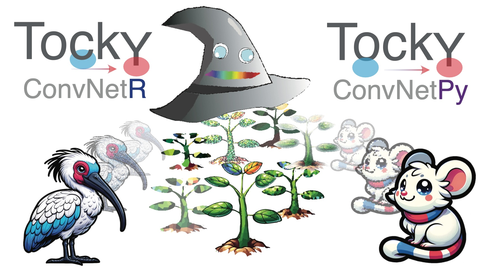

#  TockyConvNetPy: Machine Learning Python Package for Single Cell Cytometric Data using Fluorescent Timer (Beta Version)

**Author:** Dr. Masahiro Ono  
**Date:** 12 February 2025


<a href="https://monotockylab.github.io/TockyConvNetR">
  
</a>


## TockyConvNet (TockyCNN)

The **TockyML** Python package (**TockyConvNetPy**) is a part of [the **TockyMachineLearnig** toolkit](https://monotockylab.github.io/TockyMachineLearning/) and provides machine learning methods for analysing flow cytometric data from Fluorescent Timer reporters. 

Specifically, the current package **TockyConvNetPy** provides:

- ConvNet modelling and analysis using image-converted flow cytometric Tocky data generated by the R package [**TockyConvNetR**](https://monotockylab.github.io/TockyConvNetR/)
- GradCAM Analysis

The **TockyConvNet** Approach is achieved by the integrated workflow through the use of **TockyConvNetR** and **TockyConvNetPy**.

<a href="https://monotockylab.github.io/TockyConvNetR">
  
</a>
  
- **TockyConvNetR**: An R package focused on data preprocessing and feature cell analysis suitable for Convolutional Neural Network (ConvNet) analyses. This package facilitates image conversion methods for preparing Tocky data and implements Inverse GradCAM Gating Analysis to interpret ConvNet/Grad-CAM outputs.

- **TockyConvNetPy**: A Python package dedicated to performing ConvNet training and conducting Grad-CAM analysis, complementing the R-based preprocessing and analysis tools.

## Workflow

The scehametic figure below provides an overview on the workflows within TockyMachineLearning.


## Installation
To install TockyMLPy, simply run the following command in your terminal:

```bash
## Installation
### From GitHub
pip install git+https://github.com/MonoTockyLab/TockyConvNetPy.git
```

## Requirements
TockyMLPy requires the following packages:

- tensorflow=2.10.0
- keras=2.10.0
- numpy>=1.21.0,<1.22.0
- scikit-learn>=1.1.2,<1.2.0
- matplotlib>=3.5.3,<3.6.0
- scipy>=1.10.1,<1.11.0
- scikit-image>=0.19.2,<0.20.0
- pandas>=1.5.3,<1.6.0

## Example Notebook

   
### Example Notebooks as webpage


Explore our examples on how to use TockyConvNet and visualize and interpret model decisions using a GradCAM approach. 

1. The CNS2 KO Foxp3 Tocky Datasets and Model: 
	
	[View CNS2 KO Model Notebook](https://monotockylab.github.io/TockyConvNetPy/Workflow_CNS2.html)	


2. The Development-to-Ageing WT Foxp3 Tocky Datasets and Model

	[View ConvNet 3 Layers Four-Class Classifier Model Notebook](https://monotockylab.github.io/TockyConvNetPy/CNN3LayersModel.html)

	[View ConvNet 2 Layers Model Two-Class Continious Score Model Notebook](https://monotockylab.github.io/TockyConvNetPy/ContiniousScore.html)

### Example Notebooks as with JupylerLab

Example Jupyter notebooks are provided in the folder `notebooks`.

To explore the example notebook, you will need to have JupyterLab installed on your computer. See details at [Project Jupyter Homepage](https://jupyter.org/).


## Reference


